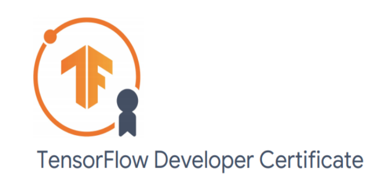

# TensorFlowPractices-for-TF-Certification
In this repository are all my practices for the tf certification.

# Practices

## Practice 1: TensorFlow 2 quickstart
This short introduction uses Keras to:
* Load a prebuilt dataset.
* Build a neural network machine learning model that classifies images.
* Train this neural network.
* Evaluate the accuracy of the model.
[Practice 1](TFpractice1MNIST.py)
